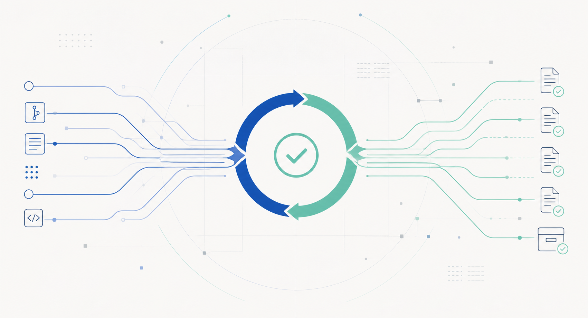

  

  

<h1 align="center">anyworkflow</h1>

<strong>离线备份仓：不是备份某一个项目，而是备份这套工作流本身。</strong>

  <a href="./docs/FULL-WORKFLOW.md">这套东西怎么运作</a>
  ·
  <a href="./docs/RECOVERY.md">如果今天要恢复它</a>
  ·
  <a href="./docs/MINIMAL-GATE.md">怎么确认这份仓不是摆设</a>

---

这份仓库现在已经不是几个散落文件，而是一份开始成形的离线档案。它的目标不是假装“什么都能在仓内证明”，而是把：
- 哪些东西已经有抄本
- 哪些证据真的跑过
- 哪些仍然只能靠仓外或人工补证

明确分开。

## 先回答三个最常见的问题

### 1. 这套东西怎么运作
先看：
1. `docs/FULL-WORKFLOW.md`
2. `docs/OFFLINE-BACKUP-SCHEME.md`
3. `docs/DEPENDENCIES.md`

### 2. 如果今天要恢复它，先看什么
先看：
1. `docs/RECOVERY.md`
2. `docs/RECOVERY-CHECKLIST.md`
3. `docs/RESTORE-DRILL-TEMPLATE.md`
4. `docs/RESTORE-DRILL-0001.md`

### 3. 怎么确认这份仓库不是摆设
先看：
1. `docs/MINIMAL-GATE.md`
2. `verify.py`
3. `docs/VERIFY-EVIDENCE-0001.md`
4. `docs/VERIFY-EVIDENCE-0002.md`

## 这里已经备份了什么
- Agent 自验证流水线的方法论
- GitHub MCP + ClickUp Skills 的闭环结构
- 观察者分工（Quinn / Devon）
- 回写、心跳、台账、恢复步骤、事故台账、依赖台账
- 共享 writeback workflow 的当前归档拷贝
- Quinn / Devon 当前 prompt 的离线副本
- 第一条恢复演练记录
- 第一条 live green 证据与第一条 deliberate red -> green 证据

## 这里明确还没有装作备份了什么
- live ClickUp 真身
- live Super Agent 当前 UI 配置
- 技能会不会靠 summary 自动触发
- 其它仓库此刻的真实状态（除非另有读回证据）
- prompt 里的散文在别的仓库改动后是否仍然为真

## 最小闸门
这份仓库有一条最小诚实闸门：`python3 verify.py`

它故意只守五件事：
- `AGENTS.md` 与 `CLAUDE.md` 逐字相同
- `docs/RECOVERY.md` 存在
- `docs/BLIND-SPOTS.md` 存在
- `manifest.json` 顶层键齐全
- `not_backed_up` 不许是空数组

为什么故意只守这么少，看 `docs/MINIMAL-GATE.md`。短版本：

> 它守的不是“系统全对”，而是“这份离线备份仓至少别先对自己撒谎”。

## 证据链
这份仓库现在已经有三种不同层次的证据：

- **结构证据**：文件在
- **正向证据**：真输入会绿（`VERIFY-EVIDENCE-0001.md`）
- **负向证据**：坏输入会红，而且修回去后会恢复绿（`VERIFY-EVIDENCE-0002.md`）

没有这三层，离线备份很容易退化成一个看起来很整齐的文件夹。

## 索引
完整索引在：`docs/INDEX.md`

如果你不想猜“现在该先看哪一份”，直接从那一页开始。

## 品牌与图形
- 当前 logo：`assets/logo-1080.png`
- README 顶部头图：`assets/hero-banner.png`
- 使用说明：`docs/BRAND.md`

## 一句话总结

这份仓库真正防的不是丢文件，而是：

> **文件都还在，但系统已经开始安静地说谎。**
